# Load Driven Branch Predictor (LDBP)

Akash Sridhar   
Computer Science and Engineering   
University of California, Santa Cruz aksridha@ucsc.edu Nursultan Kabylkas   
Computer Science and Engineering   
University of California, Santa Cruz nkabylka@ucsc.edu

Jose Renau

Computer Science and Engineering

University of California, Santa Cruz

renau@ucsc.edu

Abstract—Branch instructions dependent on hard-to-predict load data are the leading branch misprediction contributors. Current state-of-the-art history-based branch predictors have poor prediction accuracy for these branches. Prior research backs this observation by showing that increasing the size of a 256-KBit history-based branch predictor to its 1-MBit variant has just a 10% reduction in branch mispredictions.

We present the novel Load Driven Branch Predictor (LDBP) specifically targeting hard-to-predict branches dependent on a load instruction. Though random load data determines the outcome for these branches, the load address for most of these data has a predictable pattern. This is an observable template in data structures like arrays and maps. Our predictor model exploits this behavior to trigger future loads associated with branches ahead of time and use its data to predict the branch’s outcome. The predictable loads are tracked, and the precomputed outcomes of the branch instruction are buffered for making predictions. Our experimental results show that compared to a standalone 256-Kbit IMLI predictor, when LDBP is augmented with a 150- Kbit IMLI, it reduces the average branch mispredictions by 20% and improves average IPC by 13.1% for benchmarks from SPEC CINT2006 and GAP benchmark suite.

## I. INTRODUCTION

Branch mispredictions and data cache misses are the two most significant factors limiting single-thread performance in modern microprocessors. Improving the branch prediction accuracy has several benefits. First, it improves IPC by reducing the number of flushed instructions. Second, it reduces the power dissipation incurred through the execution of instructions taking the wrong path of the branch. Third, it increases the Memory Level Parallelism(MLP), which facilitates a deeper instruction window in the pipeline and supports multiple outstanding memory operations.

Current branch prediction championships and CPU designs use either perceptron-based predictors [1] [2] [3] [4] or TAGE based predictors [5] [6]. These predictors may use global and local history, and a statistical corrector to further improve performance. The TAGE-SC-L [7], which is a derivative of its previous implementation from Championship Branch Prediction (CBP-4) [8], combined several of these techniques and was the winner of the last branch prediction championship (CBP-5). Numbers from CBP-5 [7] [9] shows that scaling from a 64-Kbit TAGE predictor to unlimited size, only yields branch Mispredictions per Kilo Instructions (MPKI) reduction from 3.986 to 2.596.

Most of the current processors like AMD Zen 2, ARM A72 and Intel Skylake use some TAGE variation branch predictor. TAGE-like predictors are excellent, but there are still many difficult-to-predict branches. Seznec [8] [7] studied the prediction accuracy of a 256-Kbit TAGE predictor and a no storage limit TAGE. The 256-Kbit TAGE had only about 10% more mispredictions than its infinite size counterpart. The numbers mentioned above would reflect the prediction accuracy of the latest Zen 2 CPU [10] using a 256-Kbit TAGE-based predictor. For this work, we use the 256-Kbit TAGE-GSC + IMLI [11], which combines the global history components of the TAGE-SC-L with a loop predictor and local history as our baseline system.

Recent work [12] shows that even though the current stateof-the-art branch predictors have almost perfect prediction accuracy, there is scope for gaining significant performance by fixing the remaining mispredictions. The core architecture could be tuned to be wider if it had the support of better branch prediction, which could potentially offer more IPC gains. Prior works [13], [14] have tried to address different types of hardto-predict branches. A vital observation of these works is that most branches that state-of-the-art predictors fail to capture are branches that depend on a recent load. If the data loaded is challenging to predict, TAGE-like predictors have a low prediction accuracy as these patterns are arbitrary and too large to be captured.

The critical observation/contribution of this paper is that although the load data feeding a load-dependent branch may be random, the load address may be highly predictable for some cases. If the branch operand(s) are dependent on arbitrary load data, the branch is going to be difficult to predict. If the load address is predictable, it is possible to ”prefetch” the load ahead of time, and use the actual data value in the branch predictor.

Based on the previous observation, we propose to combine the stride address predictor [15] with a new type of the branch predictor to trigger loads ahead of time and feed the load data to the branch predictor. Then, when the corresponding branch gets fetched, the proposed predictor will have a very high accuracy even with random data. The predictor is only active for branches that have low confidence with the default predictor and depends on loads with predictable addresses. Otherwise, the default IMLI predictor performs the prediction. The proposed predictor is called Load Driven Branch Predictor (LDBP).

LDBP is an implementation of a new class of branch predictors that combine load(s) and branches to perform prediction. This new class of load-assisted branch predictors allows having near-perfect branch prediction accuracy over random data as long as the load address is predictable. It is still a prediction because there are possibilities of coherence or other forwarding issues that can make it difficult to guarantee the results.

LDBP does not require software changes or modifications to the ISA. It tracks the backward code slice starting from the branch and terminating at a set of one or more loads. If all the loads have a predictable address, and the slice is small enough to be computed, LDBP keeps track of the slice. When the same branch retires again, it will start to trigger future loads ahead of time. The next fetch of this branch uses the precomputed slice result to predict the branch outcome. Through the rest of this paper, we will refer to the load(with predictable address) that has a dependency with a branch as a trigger load and its dependent branch as a load-dependent branch.

1 addi a5,a5,4 //increments array index   
2   
3   
4 lw a4,0(a5)//loads data from array   
5 bnez a4,1043e <main+0x44>

## Listing 1. Vector traversal code snippet example

We will explain a simple code example that massively benefits from LDBP. Let us consider a simple kernel that iterates over a vector having random 0s and 1s to find values greater than zero. The branch with most mispredictions in this kernel has the assembly sequence shown in Listing 1. As we are traversing over a vector, the load addresses here are predictable, even though the data is completely random. TAGE fails to build these branch history patterns due to the dependence of the branch outcome on irregular data patterns. LDBP has near-perfect branch prediction because the trigger load (line 4) has a predictable address. LDBP triggers loads ahead of time, computes the branch-load backward slice, and stores the results. The branch uses the precomputed outcome at fetch. When we augment LDBP to a Zen 2 like core with a 256-Kbit IMLI predictor, the IPC improves by 2.6x times.

In general, a load-dependent branch immediately follows a trigger load in program order. Due to the narrow interval between these two instructions, the load data will not be available when the branch is fetched. Therefore, if this load yields a stream of random data across iterations, LDBP will have a very slim chance of making a correct prediction. To address this issue, we ensure the timeliness of the trigger loads in our setup. The key challenge is to make sure that the trigger load execution is complete before the corresponding load-dependent branch reaches fetch. By leveraging the stride predictor, we can ensure trigger load timeliness. When a branch retires, a read request for a trigger load is generated. Owing to the high predictability of their address, trigger load requests future addresses in advance. These requests have sufficient prefetch distance to cover the in-flight instructions and variable memory latency. As Section II shows, this can be achieved with very small structures incurring little hardware overhead.

To evaluate the results, we use the GAP benchmark suite [16] and the SPEC2006 integer benchmarks [17] having less than 95% prediction accuracy on our IMLI baseline. GAP is a collection of graph algorithm benchmarks. This is one of the highest performance benchmarks available, and graphs are known to be severely limited by branch prediction accuracy. We integrated an 81-Kbit LDBP to the baseline 256-Kbit IMLI predictor. Results show that LDBP fixes the topmost mispredicting branches for more than half of the benchmarks analyzed in this study. Compared to the baseline predictor, LDBP with IMLI decreases the branch MPKI by 22.7% on average across all benchmarks. Similarly, the combined predictor has an average IPC improvement of 13.7%. LDBP also eases the burden on the hardware budget of the primary predictor. When combined with a 150-Kbit IMLI predictor, the branch mispredictions come down by 20%, and the performance gain scales by 13.1% compared to the 256-Kbit IMLI, for a 9.7% lesser hardware allocation.

The rest of the paper is organized as follows: Section II describes the LDBP mechanism and architecture. Section III reports our evaluation setup methodology. Benchmark analysis, architecture analysis, and results are highlighted in Section IV. Section V presents related works. Section VI concludes the paper.

## II. LOAD DRIVEN BRANCH PREDICTOR

## A. Load-Branch Chains

The core principle of LDBP involves the exploitation of the dependency between load(s) and a branch in a load-branch chain. In this sub-section, we will explain load-branch chains in detail. LDBP needs to capture the backward slice [18] of operation sequence starting from the branch. The exit point of this slice must be a load with a predictable address or a trivially computable operation like a load immediate operation.

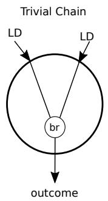

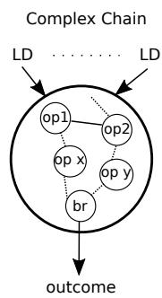

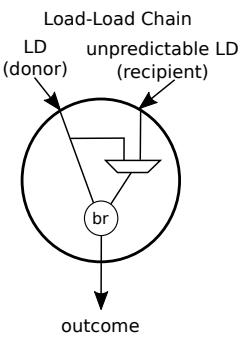  
Fig. 1. Generic load-branch chain starts with predictable loads and terminates with a branch.

As shown in Figure 1, we classify load-branch chains into 3 different types: trivial, complex and load-load chain. In a trivial chain, the branch has a single source operand (like a bnez instruction) or two source operands, and it has a direct dependency with a predictable load. No intermediate instructions modify the load data in this chain.

In a complex chain, all the branch inputs terminate with a predictable load or a load immediate. A complex chain includes at least one predictable load, one or more simple arithmetic operations, and it concludes with the branch. The LDBP framework does not track complex ALU operations, and any chain with such an operation is invalidated. We will explain load-load chain in Section IV.

A load-branch chain has two main constraints: (1) the maximum number of operations between the load and the branch, (2) the maximum number of input loads. For example, a chain can have five simple ALU operations before the branch. It means that a Finite State Machine (FSM) of the chain needs six cycles to compute the branch result. From the benchmarks we analyzed, we found that a considerable proportion of hardto-predict branches are part of a trivial load-branch chain.

## B. LDBP Architecture

In this sub-section, we explain the LDBP architecture. As LDBP works in conjunction with the primary branch predictor, its architecture aims at being simple, timely, spectre-safe, and having low power overhead. The LDBP architecture is dissected into two sub-blocks: one block attached to the cores retirement stage and another block at the fetch stage. From an abstract level, the retirement block detects potential load-branch chains, creates backward slices from the branch to its dependent load(s), and generates trigger loads. On the other hand, the fetch block uses the backward slices to build FSMs of the program sequence and computes the outcome of load-dependent branches using the executed trigger load data.

1) LDBP Retirement Block: A naive LDBP retirement block could consume significant power detecting and building backward slices all the time. To avoid this substantial power overhead, we leverage the stride address predictor that exists in many modern microarchitectures to detect predictable loads. In addition to that, LDBP attempts to identify a load-branch chain only when the load is predictable, and the associated branch has low confidence with the default predictor (in our case, it is IMLI predictor). Figure 2 shows the tables/structures associated with the retirement block.

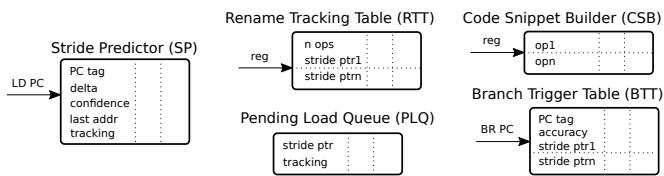  
Fig. 2. LDBP Retirement Block - Fields in each index of the tables are marked in the figure.

Stride Predictor (SP): The retiring load PC indexes the Stride Predictor table. This table has five fields. They are the PC tag (sp.pctag), the address of the last retired load (sp.lastaddr) <sup>1</sup>, the load address delta (sp.delta), a delta confidence counter (sp.confidence) and a tracking bit to indicate if a given load PC is tracked as a part of a load-branch chain (sp.tracking).

The updating policy of the confidence counter varies across different stride predictors. Standard practice involves increasing the counter each time the delta repeats and decreasing it each time the delta changes. This approach may skew the confidence either way. Ideally, increasing the counter by one and reducing it by a higher value minimizes the bias. A tracked load (with the sp.tracking set) can trigger only when its confidence counter is saturated.

Rename Tracking Table (RTT): The Rename Tracking Table detects and builds dependencies in the load-branch chains. The retiring instruction’s logical register indexes the RTT. Each table entry has a saturating counter to track the number of operations (rtt.nops) in a load-branch chain and a pointer list to track Stride Predictor entries (rtt.strideptr). The number of entries in the pointer list depends on the number of loads supported by LDBP. If a chain consists of 2 loads and 4 arithmetic operations before the branch, we need 3 bits to track these six operations and two entries on the pointer list.

Branch Trigger Table (BTT): The Branch Trigger Table links a branch with its associated loads and intermediate operations. The retiring branch PC indexes the BTT. Each entry has the following fields: the branch PC tag (btt.pctag), the list of associated loads (copied from the Stride Predictor pointer list from the RTT table (btt.strideptr)), and a 3-bit accuracy counter to track LDBP’s accuracy for this branch (btt.accuracy). If the accuracy counter reaches zero, the BTT entry gets cleared, and sp.tracking bits of the loads in btt.strideptr are reset. A BTT entry is allocated only when a load-branch chain satisfies the following three conditions: (1) the loads in the chain are predictable; (2) the retiring branch has low confidence with IMLI; (3) number of loads and number of operations in the chain is within the permissible threshold.

Code Snippet Builder (CSB): The CSB tracks the operation sequence of a load-branch chain for each logical register. Each entry on this table is a list of operations (csb.ops). The CSB entry is updated only when a new BTT entry gets allocated. This prerequisite ensures that the CSB is not polluted and minimizes power overhead. There are several works in the academic literature about building backward slices [18]. We use a table indexed by the retiring logical register (similar in behavior to an RTT). It copies the chain of operations starting from the load and terminating with the branch. Initially, we considered the possibility of combining the CSB with the RTT but dropped the idea considering the additional power dissipation this would incur. The CSB entries are only needed when a new BTT entry is populated(when a load-branch chain is established), and it would not make sense to integrate it with the RTT.

Pending Load Queue (PLQ): The tables/structures mentioned above is sufficient to detect and build load branch chains. The PLQ acts as a buffer and stores the Stride Predictor pointer list (plq.strideptr) associated with a load-branch chain. It tracks whether the last retired load had a change in delta (plq.tracking). If there is a change, it notifies the retire block to stop triggering potentially incorrect loads. Generally, loads generate prefetches when it retires. But, in our setup, we delay the trigger load generation until the branch retires to ensure correctness in trigger load generation. The PLQ ensures that the BTT gets notified about any change in the retiring load’s delta before it triggers any loads. As shown in Figure 4, PLQ allocates entries during BTT allocation.

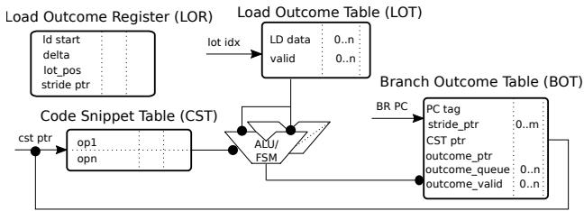  
Fig. 3. LDBP Fetch Block - Fields in each index of the tables are marked in the figure.

2) LDBP Fetch Block: The LDBP fetch block is responsible for accumulating trigger load results and computing the branch outcomes. Figure 3 shows the tables used by the fetch block, the registers associated with tracking loads, and the ALU used to compute the branch outcome for load-branch chains.

Load Outcome Table (LOT) and Load Outcome Registers (LOR): The combination of LOR and LOT stores trigger load data, which could be consumed by future branches. The lor.ldstart is the starting load address of the range, and it is updated after every branch fetch. The lor.delta field tracks the load address delta of each load tracked by LOR (lor.strideptr). The lor.lot pos field marks the data to be used by the current branch, and it helps to queue incoming data in an appropriate LOT index. The lot.valid bit gets set when the trigger load associated with that entry finishes execution.

The LOR keeps track of a range of load addresses whose data could be potentially useful for the current and future branches. The LOT caches the data associated with the addresses tracked by LOR. Each LOR entry has an associated LOT entry. Each LOT entry has an n-entry load data queue (lot.ld data) and valid bit queue (lot.valid). The ending address tracked by LOR is lor.ldstart + n ∗ lor.delta. Any trigger load address outside the address range is deemed useless, and the LOT does not cache its data.

Branch Outcome Table (BOT): The branch PC indexes the BOT at fetch (bot.pctag). As shown in Figure 4, the BOT has two main tasks. One, use the pre-computed branch outcome to predict at the fetch stage. Two, initiate the Code Snippet Table to compute the outcome for future branches.

Each BOT entry has a queue of 1-bit entries holding the branch outcome (bot.outcome queue). The length of this queue is equivalent to the number of entries in the lot.ld data queue. The bot.outcome ptr points to the current BOT outcome queue entry to be used by the incoming branch instruction. BOT uses the outcome if the corresponding bot.valid bit is set. The bot.strideptr has the list of loads associated with the branch. The Code Snippet FSM uses this field to pick appropriate load(s) from the LOR/LOT and the CST pointer (bot.cstptr) to compute the branch outcome.

Code Snippet Table (CST): The Code Snippet Table (CST) is responsible for executing the branch backward slice to compute the branch outcome. A CST entry is allocated during BOT allocation. The CST feeds the FSMs with the operation sequence of the load-branch chain. When all the trigger load data associated with the trigger branch are available, the FSM executes the code snippet to completion at the rate of one ALU operation per cycle. When large backward slices are supported, more FSMs are needed to reduce contention. The contention happens when all the FSM are busy. In this case, the branch outcome gets delayed until an FSM is free. As the BOT only tracks a small number of trigger branches, a similar-sized CST is sufficient.

## C. LDBP Flow

Figure 4 shows the interaction between different LDBP components at instruction fetch and retirement stage. Through the rest of this sub-section, we will look in detail about LDBP behavior.

1) Load Retirement: When a load retires, it updates the Stride Predictor. The sp.confidence field is updated depending upon the load address behavior. The sp.tracking for a load gets set at BOT allocation. A BOT entry allocation implies that a valid load-branch chain is present, and it is necessary to track the loads in this chain to ensure LDBP correctness.

If the sp.tracking is set, the corresponding Stride Predictor index is appended to the Pending Load Queue table (plq.strideptr). The plq.tracking bit remains set until there is a change in delta for the load it tracks.

The retiring load also resets the RTT entry indexed by its destination register. If the sp.confidence is high, the rtt.nops is initialized to zero, and the load’s pointer from the Stride Predictor is appended to the rtt.strideptr. In case the sp.confidence is low, the rtt.nops is saturated, and the RTT stride pointer list is cleared.

2) ALU Retirement: A retiring simple ALU operation (like addition) updates the RTT entries pointed by its destination register. The RTT retrieves rtt.nops and rtt.strideptr values pointed by its source registers <sup>2</sup> and accumulates it into the fields indexed by the destination register. The cumulative rtt.nops is represented by Equation 1. It is realistically infeasible to track an infinitely large load-branch chain. So, there is a threshold on the number of operations and the number of loads supported by LDBP. If these values in the RTT field exceed the limit, the corresponding RTT entry gets invalidated. For simplicity, we add the number of operands per source ignoring any potential redundancy in operations.

$$
_ { } { r t t } [ d s t ] . n o p s = { r t t } [ s r c 1 ] . n o p s + { r t t } [ s r c 2 ] . n o p s + 1\tag{1}
$$

LDBP does not support complex operations like multiplication or floating-point operations. As a result, when one of these instructions retire, the RTT entry indexed by it is invalidated to ensure a load-branch chain does not get polluted by complex operations.

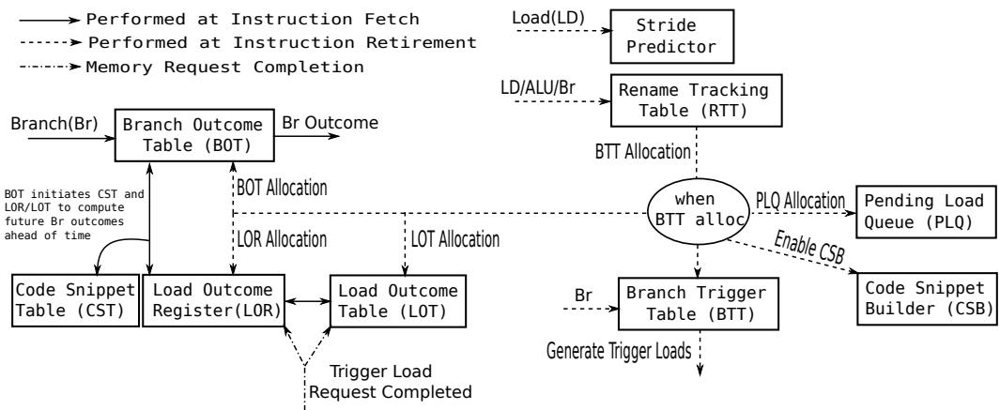  
Fig. 4. LDBP Flow - Interaction between Fetch and Retire Block.

3) Branch Retirement: At cold start, when a branch retires, it indexes the RTT only when it has low confidence with the default IMLI predictor <sup>3</sup>. RTT ensures the validity of the loadbranch chain by checking the load count and operation count in the entry indexed by the branch source(s). BTT entry gets allocated only when all the loads in this chain are predictable. BTT Allocation: On BTT allocation, the contents of the rtt.strideptr are copied to the BTT stride pointer list. The BTT accuracy counter (btt.accuracy) is initialized to half of its saturation value. The sp.tracking bit for the associated loads are set, and the CSB starts building the code snippet for this load branch chain. As shown in Figure 4, the BTT allocation creates a chain reaction by initiating the PLQ allocation, LOR/LOT allocation, and BOT allocation.

Each load associated with the branch has a unique entry during LOR/LOT allocation. Load-associated metadata from the Stride Predictor populates the LOR fields. The lor.lot pos is cleared. Similarly, BOT entry gets reset on allocation, and btt.strideptr updates the stride pointer list on the BOT. The branch’s PC tag is assigned to bot.pctag.

BTT Hit: On BTT hit, the btt.accuracy counter gets incremented if LDBP made a correct prediction, and the default IMLI predictor mispredicts and vice versa. If this counter reaches zero, the BTT deallocates the entry and the sp.tracking associated with btt.strideptr are cleared.

The CSB starts to build the code snippet for the load-branch chain on BOT allocation. After CSB completes the snippet, on a BTT hit, the code snippet is copied to the CST. The CSB is disabled after this process.

When the retiring branch hits on the BTT, it reads the corresponding PLQ entries to ensure if the tracking bit is high for the loads in the btt.strideptr. The BTT can trigger load(s) if the PLQ and LOR track all the associated loads. Equation 2 represents the address of the load triggered. The lor.ldstart is incremented by load address delta to ensure better coverage after every trigger load generation. The lor.lot pos is incremented when a new load is triggered. The trigger load distance (tl dist) and the number of triggers generated for each load can be tuned to facilitate better load timeliness.

$$
t l \_ a d d r = l o r . l d s t a r t + l o r . d e l t a * t l \_ d i s t\tag{2}
$$

There can be scenarios where the load-branch chain might change. It could happen when a different operation sequence is taken to reach the branch. There are situations where the delta associated with any of the branch’s dependent loads might change, potentially resulting in triggering incorrect loads. During such occurrences, LDBP flushes the branch entries on the BTT, BOT (and its associated CST entry), and its corresponding load entries on the LOR/LOT. The tracking bit on the Stride Predictor and PLQ are reset for these loads. Such an aggressive recovery scheme guarantees higher LDBP accuracy and reduced memory congestion due to unwanted trigger loads.

Trigger Load Completion: When a trigger load completes execution, it checks for matching entries on the LOR. There could be zero or more entries on the LOR, which could have the address range of this completed request. The address is a match on the LOR entry if it is within the LOR entry’s address range and is a factor of the lor.delta. On a hit, the corresponding LOT entry stores the trigger load data in the lot.ld data queue, and its valid bit is set. The LOT data queue index is computed using Equation 3a and 3b.

$$
l o t \_ i d = \frac { ( t l . a d d r - l o r . l d s t a r t ) } { l o r . d e l t a }\tag{3a}
$$

$$
l o t \_ i n d e x = ( l o r . l o t \_ p o s + l o t \_ i d ) \mathcal { H } l o t . l d \_ d a t a . s i z e ( )\tag{3b}
$$

4) Branch at Fetch: When a branch hits on the BOT at instruction fetch, the bot.outcome ptr is increased by one. This is the only value speculatively updated in the LDBP fetch block. When there is a table flush due to misprediction, load-branch chain change or load delta variation, the bot.outcome ptr gets flushed to zero. The BOT outcome queue entry pointed by the bot.outcome ptr yields the branch’s prediction.

The bot.cst ptr proactively instigates the computation of future branch outcomes at fetch. The CST FSMs use the load data values from valid entries on the LOT. Once the outcome is computed, the corresponding bot.outcome queue entry gets updated.

## D. Spectre-safe LDBP

The LDBP has been designed to avoid speculative updates. The reason is not to create another source of Spectre-like [19] attacks. The LDBP retirement block is only updated when the instructions are not speculative. This means that it never has any speculative information and potential speculative side-channel leak.

The LDBP fetch block is populated only with information from the retirement block. Even the trigger loads are sent when a safe target branch retires. The only speculatively updated field is the LOR table, but this table is flushed after each miss prediction, and the state is rebuilt from the LDBP retirement block.

In a way, the LDBP is not a new source of speculative leaks because it is only updated with safe information, and the fields updated speculatively are always flushed on any pipeline flush. The flush is necessary for performance, not only for Spectre. The reason is that when the ”number of in-flight” trigger loads change due to flushes, the LOR must be updated. LDBP structures are not source of speculative leaks, but the loads in the speculative path can still leak unless speculative loads are protected like in [20]. The result is that LDBP is not a new source of speculative leaks like most branch predictors that gets speculatively updated and not fixed on pipeline flushes.

## E. Multiple Paths Per Branch

The LDBP load-branch slices are generated at run-time, and they can cross branches. As a result, the same branch can have multiple chains or backward slices. These cases are sporadic in benchmarks from GAP as they have a large and somewhat regular pattern. Multi-path branches are slightly more common in the SPEC CINT2006 benchmarks.

The analysis performed as a part of this work shows that branches with multiple slices are not frequent, and when they happen, they tend to depend on unpredictable loads. Therefore, it is not a significant cause of concern for LDBP in these cases. Nevertheless, it can be an issue in other workloads. We leave it as a part of future work and possibly find benchmarks that exhibit such behavior more predominantly.

## III. SIMULATION SETUP

We evaluated LDBP using a subset of SPEC 2006 and the GAP Benchmark Suite [16]. For SPEC CINT2006, we ran all the benchmarks skipping 8 billion and modeling for 2 billion instructions. Any benchmark with branch prediction accuracy less than 95% is used for our evaluation (hmmer, astar, gobmk). The other benchmarks in the SPEC CINT2006 suite already have very low MPKI. Therefore, they would not be a true reflection of the impact of LDBP. We run all the GAP applications with “-g 19 -n 30” command line input set and instrument the benchmarks to skip the initialization, as suggested by the developers of GAP. All the benchmarks are compiled with gcc 9.2 with -Ofast -flto optimization for a RISC-V RV64 ISA.

<table><tr><td rowspan=1 colspan=1>Benchmark</td><td rowspan=1 colspan=1>Branch MPKI</td><td rowspan=1 colspan=1>IPC</td></tr><tr><td rowspan=3 colspan=1>spec06_hmmerspec06_astarspec06_gobmk</td><td rowspan=3 colspan=1>12.914.913.1</td><td rowspan=1 colspan=1>2.42</td></tr><tr><td rowspan=1 colspan=1>0.89</td></tr><tr><td rowspan=1 colspan=1>1.49</td></tr><tr><td rowspan=5 colspan=1>gap_bfsgap_prgap_tcgap_ccgap_bcgap_sssp</td><td rowspan=5 colspan=1>23.94.644.532.722.06.2</td><td rowspan=1 colspan=1>0.66</td></tr><tr><td rowspan=1 colspan=1>1.64</td></tr><tr><td rowspan=1 colspan=1>1.070.51</td></tr><tr><td rowspan=1 colspan=1>1.14</td></tr><tr><td rowspan=1 colspan=1>0.89</td></tr></table>

TABLE I  
BENCHMARKS USED AND THEIR MPKI AND IPC RUNNING BASELINE 256-KBIT IMLI.

We use ESESC [21] as the timing simulator. The processor configuration is set to closely model an AMD Zen 2 core [10]. Table I shows the Instructions Per Cycle (IPC) and MPKI for the benchmarks investigated when running the baseline 256-Kbit IMLI predictor. To match the Zen 2 architecture, the baseline branch prediction unit has a fast (1 cycle) branch predictor and a slower but more accurate (2 cycle) IMLI branch predictor. We evaluate the baseline configuration against 1-Mbit IMLI, and different IMLI configurations (150-Kbit, 256-Kbit, and 1-Mbit) augmented with an 81-Kbit LDBP.

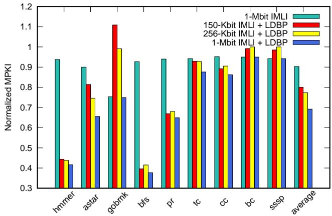  
Fig. 5. LDBP minimizes the mispredictions by more than 22.7% when combined with the baseline 256-Kbit IMLI.

## IV. RESULTS AND ANALYSIS

In this section, we highlight the results of our study. We compare the performance, and misprediction rate variations between the baseline IMLI predictor and our proposed LDBP predictor augmented to IMLI. Mispredictions Per Kilo Instruction (MPKI) is the metric used to compare the misprediction rate in this section.

Figure 5 shows the normalized MPKI values compared to the baseline IMLI for different branch predictor configurations. LDBP has a considerable impact on more than half of the benchmarks. On average, the IMLI 256-Kbit + LDBP predictor reduces the MPKI of GAP and SPEC CINT2006 benchmarks by 17.9% and 27.5%, respectively. As shown in Table I, astar had the worst branch prediction accuracy in the SPEC CINT2006 suite. The most mispredicting branch in astar constitutes 22% of the benchmark’s mispredictions. This branch has a direct dependency with a load, but LDBP cannot fix this branch as the address of the load feeding this branch has a fluctuating delta. LDBP manages to minimize astar’s total branch misses by 25.4% without fixing the most mispredicting branch. These numbers attest to the fact that a considerable proportion of hard-to-predict branches on most benchmarks depend on data from loads with a predictable address. Another observation to note is that quadrupling the size of IMLI fixes only 9.7% branch misses from the baseline. This inference substantiates the fact that a huge TAGE-like predictor cannot efficiently capture the history of hard-to-predict data-dependent branches.

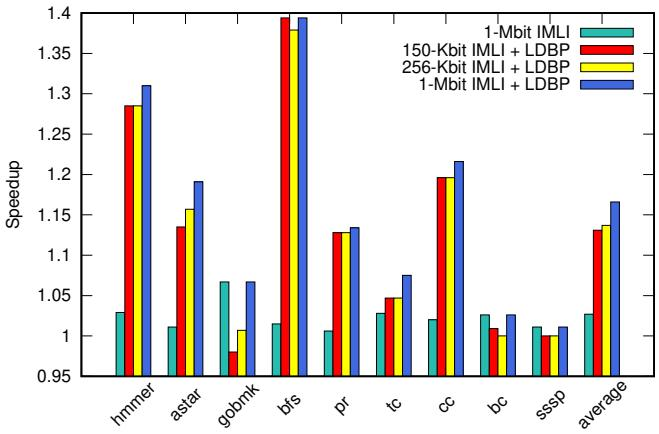  
Fig. 6. LDBP (when combined with 150-Kbit IMLI or 256-Kbit IMLI) outperforms the large 1-Mbit IMLI comprehensively.

Figure 6 compares IPC changes over baseline 256-Kbit IMLI for different branch predictor configurations. LDBP was able to achieve an average IPC improvement of 13.7% when paired with the baseline predictor. An interesting observation is that the GAP benchmarks have a speedup of 12.5% with this configuration. In contrast, they have a slightly better IPC gain of 12.9% over the baseline when running on 150-Kbit IMLI + LDBP. The reason for this trend is that a smaller IMLI can fix lesser branches, and LDBP fixes branches that have low confidence with IMLI. Therefore, lower the MPKI of the primary predictor, more the work for LDBP. A 41% smaller IMLI (150-Kbit) with LDBP produced similar IPC and MPKI numbers to that of the baseline IMLI-LDBP combination. For some benchmarks like bfs, the smaller predictor even outperformed its larger counterpart. Moreover, the 150-Kbit IMLI + 81-Kbit LDBP offers 13.1% higher performance gain and 20% lesser branch misses than the baseline 256-Kbit IMLI for a 9.7% lower hardware budget.

The MPKI and performance improvements yielded by LDBP clearly shows that hard-to-predict load-dependent branches are major contributors to overall mispredictions in benchmarks across different application suites. LDBP does not affect some benchmarks like gobmk, sssp and bc. This behavior can be attributed that mispredicting branches in these benchmarks do not have a load-branch dependency that can be captured by LDBP. An anomaly to note on Figure 5 and 6 is the behavior of gobmk running with 150-Kbit IMLI and LDBP. We can notice that the IPC decreases by 2%, and the MPKI worsens by 10%. It is because the 150-Kbit IMLI has a worse MPKI and IPC compared to the baseline 256-KBit IMLI. Added to that, LDBP does not yield any improvement for gobmk.

```csv
1 L2: addi a7,a7,1
2 ld a5,8(t5)
3 bge a7,a5,L1 //outer ’for’ loop
4 sext.w t6,a7
5 slli t1,a7,0x2
6 ld a5,0(a1)
7 add t1,t1,a5
8 lw a5,0(t1)
9 bgez a5,L2 //’if’ condition check
```  
Listing 2. GAP BFS RISC-V Assembly for Listing 3

## A. Benchmark Study

In this sub-section, we analyze examples from different benchmarks where LDBP works and cases where LDBP doesn’t work.

1) Case 1: BFS (GAP Benchmark Suite): For our first case study, we look at the Breadth-First Search (BFS) algorithm. It is one of the most popular graph traversal algorithms used across several domains. Listing 2 and Listing 3 shows a snippet of RISC-V assembly and its corresponding pseudo code from GAP’s BFS benchmark. Here, the loop traverses over all the nodes in the graph to assign a parent to each node. The arbitrary nature of the graph makes it hard to predict if a node has a valid parent as each node can have multiple possible edges, but the node traversal is in order. It is hard to predict parent[u], but u is easily predictable (Line 2 in Listing 3). The branch in Line 9 in Listing 2 is the most mispredicted branch in this benchmark. It contributes to about 30% of all mispredictions when simulated on the baseline architecture with 256-Kbit IMLI. When we augment LDBP into this setup, it resolves about 94% for the mispredictions of this branch and reduces the overall MPKI by 59%. It is also instrumental in gaining 38% speedup.

1 for(NodeID u=0; u < g.num\_nodes(); u++){   
2 if(parent[u] < 0){   
3   
4   
5 }   
6 }  
Listing 3. GAP BFS Source Code Snippet

2) Case 2: HMMER (SPEC CINT 2006): Listing 4 shows the RISC-V assembly code section of the branch (line 8) contributing to most misprediction in SPEC CINT2006 hmmer. It accounts for 39% of all mispredicted branches. The branch outcome is dependent on values from different matrices. The randomness of the data involved makes this a very hard-topredict branch. Each branch source operand is dependent on two loads. As we traverse over matrices, the loads involved in this case have a traceable address pattern. LDBP has to track four different loads and some intermediate ALU operations to make the prediction. LDBP fixes 67% of the mispredictions yielded by bge. Appending LDBP to the baseline IMLI improves the IPC by 29% and reduces the overall MPKI of this benchmark by 56%.

```asm
1 lw s11, 0(a3)
2 lw a3, 4(a7)
3 addw a3, s11, a3
4 sw a3, 0(t3)
5 lw s10, 0(s10)
6 lw s11, 4(t1)
7 addw s11, s10, s11
8 bge a3, s11, LABEL
```  
Listing 4. SPEC CINT2006 hmmer RISC-V Assembly

3) Case 3: CC (GAP Benchmark Suite): Listing 5 represents the code-snippet containing the branch (line 5) with most mispredictions in the CC benchmark. It constitutes a little more than one-third of all mispredictions in this benchmark. LDBP cannot capture this load-branch chain. At first glance, it might look like the branch instruction’s source operands are dependent on two loads. On deeper introspection, we notice that the source operand (load address) of the lw instruction (recipient) on line 5 is determined by the load data of the previous lw (donor) on line 1. We refer to such a dependency as a load-load chain. Figure 1 represents a load-load chain.

```asm
1 lw a6, 0(a4)
2 slli a5, a6, 0x2
3 add a5, a5, a0
4 lw a5, 0(a5)
5 beq a6, a5, LABEL
```  
Listing 5. GAP CC RISC-V Assembly

The current LDBP setup does not support load-branch slices having a load-load chain. If the address of the first load instruction is predictable by the stride predictor, we can use its data to prefetch the second load. Similar to the backward slice computation of the load-branch chain, we need to build a backward chain starting from the recipient load and ending with the donor. If the load-load chain is predictable, then LDBP can build the load-branch slice and generate predictions. This implementation is a part of our immediate future work.

<table><tr><td>Structure Name</td><td>No. of Entries</td><td>Total Size (Kbit)</td></tr><tr><td>Stride Predictor</td><td>48</td><td>2.39</td></tr><tr><td>Rename Tracking Table (RTT)</td><td>32</td><td>3.09</td></tr><tr><td>Pending Load Queue (PLQ)</td><td>48</td><td>0.33</td></tr><tr><td>Branch Trigger Table (BTT)</td><td>8</td><td>0.88</td></tr><tr><td>Code Snippet Builder (CSB)</td><td>32</td><td>4</td></tr><tr><td>Load Outcome Register (LOR)</td><td>16</td><td>1.44</td></tr><tr><td>Load Outcome Table (LOT)</td><td>16</td><td>65</td></tr><tr><td>Branch Outcome Table (BOT)</td><td>8</td><td>1.93</td></tr><tr><td>Code Snippet Table (CST)</td><td>8</td><td>2</td></tr><tr><td>Total LDBP Size</td><td></td><td>81.06</td></tr></table>

TABLE II OVERALL LDBP SIZE IS 81-KBIT

## B. LDBP Table Sizing

In this sub-section, we explain the methodology used to size the tables in LDBP. We analyze the variation in MPKI for a different number of entries in each structure in the predictor. Here, MPKI is the average MPKI of the benchmarks used. We define a baseline infinite LDBP predictor. The infinite LDBP has 512 entries in each table. When the MPKI sensitivity for a table’s size is analyzed, all other tables in LDBP have 512 entries. Such an approach ensures a fair estimation of the table’s impact on LDBP accuracy. A 2% MPKI increase from infinite LDBP is the cut-off used to determine the ideal table size. Table II shows overall size of LDBP and the breakdown of individual table sizes.

The overall size for the LDBP is 81-Kbit. As a reference, the IMLI predictor used is 256-Kbit. The fetch block in a processor like a Zen 2 also includes a 32-KByte instruction cache and two-level BTBs with 512 and 7K entries. The largest LDBP table is the LOT that can use area-efficient single port SRAMs.

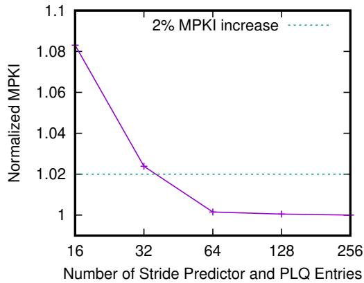  
Fig. 7. 48 entries are sufficient in the Stride Predictor and PLQ to achieve prediction accuracy varying by less than 2% from the infinite LDBP.

1) Stride Predictor and PLQ Sizing: Figure 7 shows the impact of the number of entries on the Stride Predictor and the PLQ on MPKI. We can see that the MPKI drop is going over 2% when the number of entries is around 32. With reduced stride predictor and PLQ entries, a load tracked as a part of the hard-to-predict load-dependent branch’s chain can be evicted to make way for a new incoming load. LDBP cannot determine if a load is trigger-worthy if it is not in the stride predictor table. Entries larger than 64 have a negligible effect on the MPKI. The stride predictor and PLQ have 48 entries each as it offers the perfect equilibrium between MPKI and hardware size.

2) LOR and LOT Sizing: Figure 8 plots the effect of varying LOR size on MPKI. There is a sharp increase in MPKI when the number of trigger loads tracked is less than 16. At the 2% cut-off point, LOR and LOT has around 12 entries. To minimize the impact of the sharp drop in MPKI, we allocate 16 entries to both the LOR and LOT. The necessity to store the complete load data contributes to the large size of the LOT. The number of entries on the LOT data queue is determined by how proactively LDBP wants to predict branches and trigger its associated loads. The number of entries on the BOT’s outcome queue matches the LOT data queue entries. The sizing of the BOT outcome queue is discussed in Section IV-B3.

Number of LOT Data Queue and Outcome Queue En  
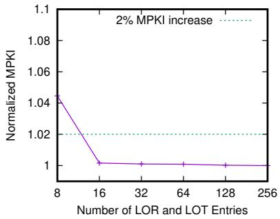  
Fig. 8. Tracking 16 loads on the LOR and LOT is adequate to maintain high LDBP accuracy.

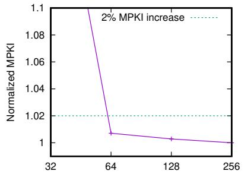  
Fig. 9. The LOT Data Queue and Outcome Queue requires 64 entries each.

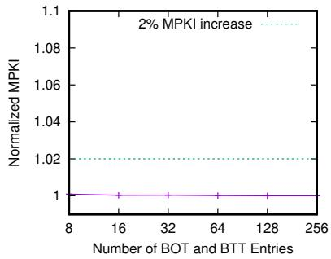  
Fig. 10. Effectiveness of LDBP remains steady for different number of entries on the BOT and BTT.

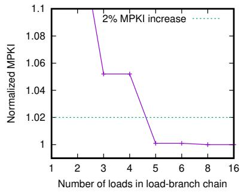  
Fig. 11. LDBP must track at least 5 loads to maintain healthy prediction accuracy.

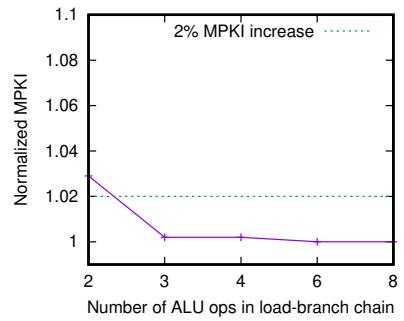  
Fig. 12. Most LDBP chains have 3 ALU operations between the loads and branch.

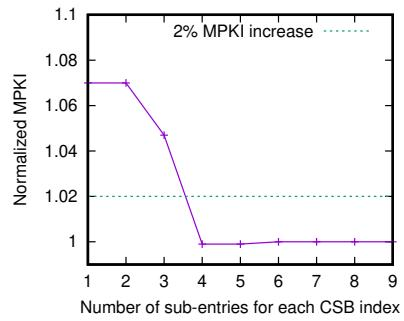  
Fig. 13. Each CSB index must have 4 sub-entries to capture LDBP backward slice.

Some load-dependent branches may consume two or more trigger loads. A bottleneck on the number of trigger loads tracked has a direct implication on the effectiveness of LDBP. In most cases, the load-dependent branch tends to be the entrypoint to a huge loop. In such cases, it sufficient for LDBP to track just one branch and its associated trigger loads. Therefore, a reasonably small to medium number of entries on the LOR and LOT is adequate to maintain LDBP accuracy.

3) Outcome Queue/LOT Data Queue Sizing: The outcome queue is part of the BOT. The criticality of the outcome queue in the overall scheme of LDBP warranted optimal sizing. The number of entries in this queue correlates to the number of future outcomes trackable for a given branch PC. The outcome queue entries directly impact the number of entries on the LOT data queue. It is sufficient for the LOT data queue to have as many entries as the branches tracked by the outcome queue. From Figure 9, the ideal number of outcome queue entries at the cut-off point is 64. As the outcome queue size decreases, the MPKI increase gets steeper. A smaller outcome queue inhibits the ability of LDBP to trigger loads with higher prefetch distance. On the flip side, the outcome queue size larger than 64 almost hits an MPKI plateau.

4) BOT and BTT Sizing: Figure 10 shows the variation of MPKI for different sizes of BOT and BTT. Just like the LOR and LOT, a small to a medium number of entries on the BOT and BTT is sufficient to track almost every load-dependent branch in an application. These branches are usually part of large loops. These huge loops give LDBP adequate time to capture the new branch-load chain even if they replace an already existing entry from the tables. The correlation between the number of entries and MPKI has very minimal variations. Therefore, it is sufficient to have just 8 entries on the BOT and BTT.

5) CSB and CST Sizing: The CSB builds the load-branch slice. It is critical to size this table optimally to keep LDBP’s hardware budget under check. Figure 11 and 12 shows the change of MPKI for different load and ALU operations threshold in an LDBP chain. Five loads and three ALU operations are needed to ensure maximum LDBP efficiency. These figures reflect the cumulative number of operations tracked by both the source operands of a branch instruction. Each source operand of the branch might need to track only fewer operations.

Figure 13 shows the number of sub-entries needed by each CSB index. This figure clearly shows that it is sufficient for each branch source register to track four operations to support an LDBP chain with a maximum of eight operations. There are 32 entries on the CSB, and each entry track four operations. The total size of the CSB is 4-Kbit. The CST caches the backward slice of each branch. As there are 8 entries on the BOT, the CST must have 8 entries with 8 sub-entries (4 sub-entry for each branch source operand).

## C. LDBP Gating and Energy Implications

The LDBP has significant performance gains, but some benchmarks (gobmk, sssp, bc) do not benefit. We evaluate the effectiveness of gating the LDBP when infrequently used, to save energy consumption.

We gate (low-power mode) every component of LDBP apart from the Stride Predictor and RTT when there is a duration of 100,000 or more clock cycles where LDBP did not predict any branch. We refer to this phase as the LDBP low-power mode. As shown in Table III, for bc and sssp, LDBP remains in lowpower mode for 99.5% and 98.2% of the benchmark’s execution time, respectively. Gating offers a considerable reduction in energy dissipated by LDBP as the predictor remains in lowpower mode for 38.5% of the average execution time across all benchmarks, and LDBP gating does not have any negative effect on the prediction accuracy of LDBP.

<table><tr><td>Benchmark</td><td>% time in low-power mode</td></tr><tr><td>spec06_hmmer spec06_astar</td><td>0.0 54.6</td></tr><tr><td>spec06_gobmk</td><td>36.1</td></tr><tr><td>gap_bfs</td><td>4.0</td></tr><tr><td>gap_pr</td><td>2.8</td></tr><tr><td>gap_tc</td><td>0.2</td></tr><tr><td>gap_cc</td><td>50.8</td></tr><tr><td>gap_bc</td><td>99.5</td></tr><tr><td>gap_sssp</td><td>98.2</td></tr></table>

TABLE III  
PROPORTION OF EXECUTION TIME IN LDBP LOW-POWER MODE

Haj-Yihia et al. [22] present a detailed breakdown of core power consumption for high-performance modern CPUs running SPEC CINT2006 benchmarks. We use the data presented in their work to estimate the core energy dissipation for our analysis. For our baseline energy model, we replicate the core power breakdown given in [22] for hmmer, astar and gobmk. For the GAP benchmarks, we use the average power breakdown of SPEC CINT2006 benchmarks given in [22]. The broadspectrum power model based on SPEC CINT2006 benchmarks is good enough to capture the energy dissipation behavior of GAP benchmarks with a good level of accuracy.

Energy Per Access (EPA) for IMLI and LDBP were calculated using CACTI 6.0 [23]. For IMLI, we model an ideal structure with a single port. LDBP has 55% lesser EPA than IMLI even if we assume all the tables are accessed when not in low power mode, which is not the case in reality. There is a 10.9% average increase in DL1 access for LDBP, which will result in an equivalent escalation in energy on the memory sub-system. The 22.7% decrease in MPKI when using LDBP will compensate for this increase in energy dissipation. Lesser MPKI implies lesser energy spent on executing the wrong branch path. We do not account for the energy saved due to reduced wrong path execution in the LDBP energy estimation numbers. Added to that, we also do not account for the energy reduction incurred due to 13.3% lesser execution time when using LDBP. Reducing execution time results in reduced energy, and our pessimistic energy estimation model for LDBP does not consider this.

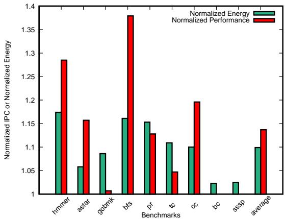  
Fig. 14. LDBP maintains a favorable energy-performance tradeoff.

Figure 14 shows the energy-performance tradeoff for IMLI + LDBP compared to the baseline 256-Kbit IMLI. The IPC boost outweighs the increase in energy dissipation for the majority of the benchmarks that benefit from LDBP. Benchmarks like bc and sssp only have about 2% energy overhead as the RTT and Stride Predictor continue to be active even under low-power mode. Interestingly, LDBP only predicts a negligible proportion of branches in gobmk, but it contributes to 8% more energy use. This is because LDBP resolves multiple low-frequency branches that spread across different execution phases. Thus, gobmk does not offer a consistent low-power mode phase for LDBP. A more aggressive clock gating with retention state or smarter phase learning could further improve the gobmk case, but we leave it as future work.

## D. Impact of Triggering Loads on LDBP Performance Gains

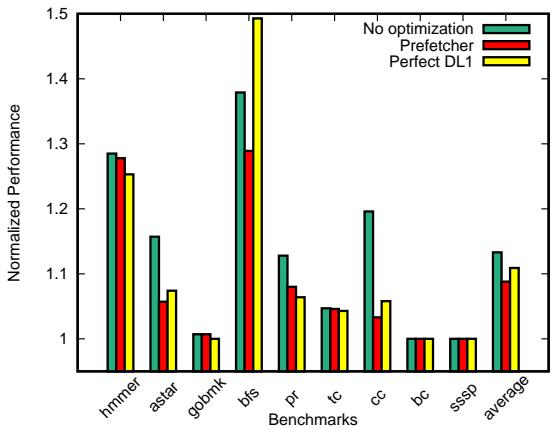  
Fig. 15. Triggering loads does not offer any unfair gains to LDBP.

Figure 15 shows the normalized speedup of LDBP over 256- Kbit IMLI with three different Zen 2 core configurations. One, the default Zen-2 core used for evaluation in other parts of this paper. Two, the default core with a standard stride prefetcher and third, the default core with perfect DL1 cache. We can notice that the IPC numbers are almost similar across all three configurations for most benchmarks. This clearly shows that prefetching trigger loads in LDBP do not provide an unfair advantage to it over the standalone IMLI predictor. Maybe even more important, Figure 15 shows that the LDBP benefits are consistent independent of memory sub-system improvements.

## E. Trigger Load Timeliness

In this sub-section, we will focus on trigger load prefetch distance and its importance in achieving optimum LDBP timeliness. We will use Listing 1 to highlight the criticality of timely trigger loads. This example is the vector traversal problem discussed in Section I. In the example we discuss, let us assume a scenario where it takes six cycles to load data from the vector, and there are ten inflight load-branch iterations. As the load address has a delta of 8, to achieve an IPC of 1, we need to send the new trigger load at least 16 cycles ahead. If the current load address is x, LDBP triggers a load address with a distance of 16 $( x + 8 * 1 6 )$ . In reality, it would be ideal to use even a larger distance to compensate for variable memory latencies. Larger trigger distances require more buffering and can be potentially more wasteful if the stride pattern changes. Triggering too far ahead can also pollute the cache and could evict useful lines. Another vital point to note is, a trigger load is an actual load and not a prefetch. We overlooked the idea of using prefetches in LDBP as it has the potential to be dropped.

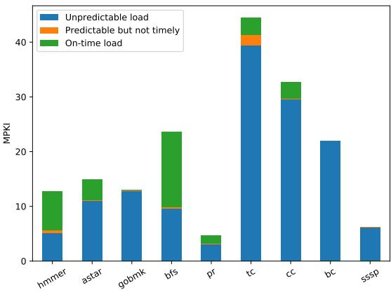  
Fig. 16. MPKI variation vs Trigger Load Timeliness.

Figure 16 shows the MPKI of different benchmarks recorded with the baseline IMLI predictor. The portion of the bar shaded in green points to the number of mispredictions fixed by LDBP due to the timely execution of trigger loads. We can see the correlation between the number of predictable loads in a benchmark and LDBP effectiveness. The timeliness of these predictable load helps to exploit the maximum potency of LDBP. Only for the tc benchmark, a significant portion of the loads are not predictable. Though we optimized the methodology to trigger loads, these outliers can be attributed to the change in load delta, which creates considerable delay due to relearning time. Another potential reason could be memory bandwidth congestion. Minimizing the number of delayed trigger loads could lead to significant MPKI reduction.

## V. RELATED WORK

The strides in branch prediction accuracy have improved several folds since the counter-based bimodal predictor [24]. The ensuing works on branch prediction gradually raised the bar for the prediction accuracy. Yeh and Patt came up with the two-level branch predictors [25]. McFarling [26] proposed optimizations over their work. These works leverage the high correlation between the outcome of the current branch and the history of previous branch outcomes.

PPM-like [27] and TAGE [5] achieve higher prediction accuracy by tracking longer histories. They use multiple prediction tables, each indexed by a longer global history than its preceding table. TAGE-based predictors are the state-of-theart predictors, and they offer very high prediction accuracy. TAGE-based predictors fail to capture the outcome correlation of branches having an irregular periodicity or when a branch outcome history is too long or too random to capture.

Statistical correlator [28] and IMLI [11] components are augmented to TAGE to mitigate some of the mispredictions. Several studies and extensive workload analysis have identified different types of hard-to-predict branches and ways to resolve them. Sherwood et al. [29] and Morris et al. [30] proposed prediction mechanisms to tackle loop-termination branches. The Wormhole predictor [31] improved on earlier loop-based predictors to handle branches enclosed within nested loop and branches exhibiting correlation across different iterations of the outer loop.

Branches dependent on random data from load instructions contribute to a high percentage of mispredictions with TAGEbases predictors. It is impossible to capture the history of such branches competently, even with an unusually large predictor. Prior works [32], [33] show that using data values as an input to the branch predictor improves the misprediction rate. Farooq et al. [14] note that some hard-to-predict data-dependent branches manifest a specific pattern of a store-load-branch chain. They leverage this observation to mark the stores that are in the chain at compile-time and compute branch conditions based on the values of marked stores at run-time in hardware. We tackle a similar problem, but our work is based on the observation that a considerable proportion of hard-to-predict data-dependent branches are dependent on the loads whose address is very predictable. Moreover, we do not make any modifications to the ISA. Gao et al. [13] proposed a closely related work. They correlate the branch outcome to the load address and provide a prediction based on the confidence of the correlation. Nevertheless, our approach differs in that we precalculate the branch outcomes by triggering loads that are part of the branch’s dependence chain and have a highly predictable address.

## VI. CONCLUSIONS

As shown by the benchmarks evaluated in our work, branch outcomes dependent on arbitrary load data are hard to-predict and contribute to most mispredictions. They have poor prediction accuracy with current state-of-the-art branch predictors. These branch patterns are common in data structures like vector, maps, and graphs. We propose the Load Driven

Branch Predictor (LDBP) to eliminates the misses contributed by this class of branch. LDBP exploits the predictable nature of the address of the loads on which these hard-to-predict branches depend on and triggers these dependent loads ahead of time. The triggered load data are used to precompute the branch outcome. With LDBP, programmers can traverse over large vectors/maps, do data-dependent branches, and still have near-perfect branch prediction.

LDBP contributes to minimal hardware and power overhead and does not require any changes to the ISA. Our experimental results show that compared to the standalone 256-Kbit IMLI predictor, the combination of 256-Kbit IMLI and LDBP predictor shrinks the branch MPKI by 22.7% and improves the IPC by 13.7%. The efficiency of LDBP also allows having a smaller primary predictor. A 150-Kbit IMLI + LDBP predictor yields performance improvement of 13.1% and 20% lesser mispredictions compared to the baseline 256-Kbit IMLI.

Another opportunity that this work provides is to extend the use of graphs further. As the GAP benchmark suite results show, LDBP can improve performance from graph traversals significantly. There is an extensive set of works exploring graphs for neural networks [34], for which LDBP could help to boost the performance.

## VII. ACKNOWLEDGEMENTS

This work was supported in part by the National Science Foundation under grant CCF-1514284. Any opinions, findings, and conclusions or recommendations expressed herein are those of the authors and do not necessarily reflect the views of the NSF. This material is based upon work supported by, or in part by, the Army Research Laboratory and the Army Research Office under contract/grant W911NF1910466.

## REFERENCES

[1] D. A. Jimenez and C. Lin, “Dynamic branch prediction with perceptrons,”´ in Proceedings HPCA Seventh International Symposium on High-Performance Computer Architecture. IEEE, 2001, pp. 197–206.

[2] D. A. Jimenez, “Fast path-based neural branch prediction,” in´ Proceedings of the 36th annual IEEE/ACM International Symposium on Microarchi tecture. IEEE Computer Society, 2003, p. 243.

[3] Y. Ishii, “Fused two-level branch prediction with ahead calculation,” Journal of Instruction-Level Parallelism, vol. 9, pp. 1–19, 2007.

[4] D. A. Jimenez and C. Lin, “Neural methods for dynamic branch´ prediction,” ACM Transactions on Computer Systems (TOCS), vol. 20, no. 4, pp. 369–397, 2002.

[5] A. Seznec, “A case for (partially)-tagged geometric history length predictors,” Journal of InstructionLevel Parallelism, 2006.

[6] A.Seznec, “A new case for the tage branch predictor,” in Proceedings of the 44th Annual IEEE/ACM International Symposium on Microarchitec ture. ACM, 2011, pp. 117–127.

[7] A. Seznec, “Tage-sc-l branch predictors again,” 2016.

[8] A.Seznec, “Tage-sc-l branch predictors,” 2014.

[9] A. Seznec, “Exploring branch predictability limits with the mtage+ sc predictor,” 2016.

[10] D. Suggs, D. Bouvier, M. Clark, K. Lepak, and M. Subramony, “Zen 2,” https://www.hotchips.org/hc31/HC31 1.1 AMD ZEN2.pdf.

[11] A. Seznec, J. San Miguel, and J. Albericio, “The inner most loop iteration counter: a new dimension in branch history,” in 2015 48th Annual IEEE/ACM International Symposium on Microarchitecture (MICRO). IEEE, 2015, pp. 347–357.

[12] C.-K. Lin and S. J. Tarsa, “Branch prediction is not a solved problem: Measurements, opportunities, and future directions,” 2019.

[13] H. Gao, Y. Ma, M. Dimitrov, and H. Zhou, “Address-branch correlation: A novel locality for long-latency hard-to-predict branches,” in 2008 IEEE 14th International Symposium on High Performance Computer Architecture. IEEE, 2008, pp. 74–85.

[14] M. U. Farooq, Khubaib, and L. K. John, “Store-load-branch (slb) predictor: A compiler assisted branch prediction for data dependent branches,” in 2013 IEEE 19th International Symposium on High Performance Computer Architecture (HPCA). IEEE, 2013, pp. 59– 70.

[15] J. W. Fu, J. H. Patel, and B. L. Janssens, “Stride directed prefetching in scalar processors,” ACM SIGMICRO Newsletter, vol. 23, no. 1-2, pp. 102–110, 1992.

[16] S. Beamer, K. Asanovic, and D. Patterson, “The gap benchmark suite,”´ arXiv preprint arXiv:1508.03619, 2015.

[17] J. L. Henning, “Spec cpu2006 benchmark descriptions,” ACM SIGARCH Computer Architecture News, vol. 34, no. 4, pp. 1–17, 2006.

[18] A. Moshovos, D. Pnevmatikatos, and A. Baniasadi, “Slice-processors: an Implementation of Operation-Based Prediction,” in International Conference on Supercomputing, Sorrento, Italy, Jun. 2001, pp. 321–334.

[19] P. Kocher, D. Genkin, D. Gruss, W. Haas, M. Hamburg, M. Lipp, S. Mangard, T. Prescher, M. Schwarz, and Y. Yarom, “Spectre attacks: Exploiting speculative execution,” arXiv preprint arXiv:1801.01203, 2018.

[20] C. Sakalis, S. Kaxiras, A. Ros, A. Jimborean, and M. Sjalander, ¨ “Efficient invisible speculative execution through selective delay and value prediction,” in Proceedings of the 46th International Symposium on Computer Architecture, 2019, pp. 723–735.

[21] E. K. Ardestani and J. Renau, “ESESC: A fast multicore simulator using time-based sampling,” in High Performance Computer Architecture, Proceedings of the IEEE 19th International Symposium on, ser. HPCA’13. Washington, DC, USA: IEEE Computer Society, Feb. 2013, pp. 448–459. [Online]. Available: http://dx.doi.org/10.1109/HPCA.2013.6522340

[22] J. Haj-Yihia, A. Yasin, Y. B. Asher, and A. Mendelson, “Fine-grain power breakdown of modern out-of-order cores and its implications on skylake-based systems,” ACM Transactions on Architecture and Code Optimization (TACO), vol. 13, no. 4, pp. 1–25, 2016.

[23] N. Muralimanohar, R. Balasubramonian, and N. P. Jouppi, “Cacti 6.0: A tool to model large caches,” HP laboratories, vol. 27, p. 28, 2009.

[24] J. E. Smith, “A study of branch prediction strategies,” in Proceedings of the 8th Annual Symposium on Computer Architecture, ser. ISCA ’81. Washington, DC, USA: IEEE Computer Society Press, 1981, pp. 135–148.

[25] T.-Y. Yeh and Y. N. Patt, “Two-level adaptive training branch prediction,” 24th Int’l Symp. on Microarchitecture, pp. 51–61, Nov. 1991.

[26] S. McFarling, “Combining Branch Predictors,” Tech. Rep. TN-36, Jun 1993.

[27] P. Michaud, “A ppm-like, tag-based branch predictor,” Journal of Instruction-Level Parallelism, vol. 7, pp. 1–10, 04 2005.

[28] A. Seznec, “A 64 kbytes isl-tage branch predictor,” 2011.

[29] T. Sherwood and B. Calder, “Loop termination prediction,” in Proceedings of the Third International Symposium on High Performance Computing, ser. ISHPC ’00. Berlin, Heidelberg: Springer-Verlag, 2000, pp. 73–87.

[30] D. Morris, M. Poplingher, T.-Y. Yeh, M. P. Corwin, and W. Chen, “Method and apparatus for predicting loop exit branches,” 2002.

[31] J. Albericio, J. S. Miguel, N. E. Jerger, and A. Moshovos, “Wormhole: Wisely predicting multidimensional branches,” in Proceedings of the 47th Annual IEEE/ACM International Symposium on Microarchitecture, ser. MICRO-47. USA: IEEE Computer Society, 2014, pp. 509–520. [Online]. Available: https://doi.org/10.1109/MICRO.2014.40

[32] T. H. Heil, Z. Smith, and J. E. Smith, “Improving branch predictors by correlating on data values,” in MICRO-32. Proceedings of the 32nd Annual ACM/IEEE International Symposium on Microarchitecture, 1999, pp. 28–37.

[33] L. Chen, S. Dropsho, and D. H. Albonesi, “Dynamic data dependence tracking and its application to branch prediction,” in Proceedings of the 9th International Symposium on High-Performance Computer Architecture, ser. HPCA ’03. USA: IEEE Computer Society, 2003, p. 65.

[34] Z. Wu, S. Pan, F. Chen, G. Long, C. Zhang, and P. S. Yu, “A comprehensive survey on graph neural networks,” 2019.